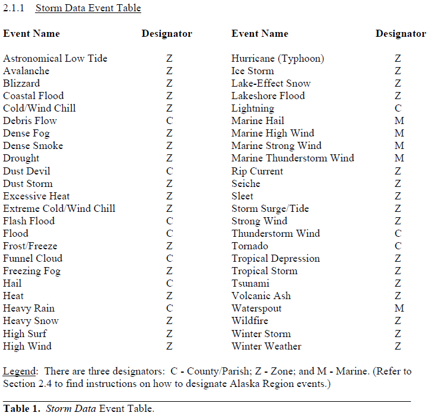

#Heat and Hurricanes Contribute The Most Towards Health and Economic Costs

##Synopsis

National Oceanic and Atmospheric Administration (NOAA) keeps a database of severe weather events which tracks various characteristics such as fatalities and property damage. The data was downloaded and shaped to fit the current guidelines. The human cost was calculated using the mean of the fatalities and injuries and the financial cost by the mean of the property and crop damage.  The top 10 events for each were plotted.  The results show that heat caused the most human damage while hurricanes contributed the most to economical damage. 

##Data Processing

###Cleaning the Data

First, packages were loaded:

```{r}
require(dplyr)
require(tidyr)
require(ggplot2)
require(reshape2)
```

The raw storm data file was downloaded and read into R.  To save time and prevent multiple downloads, both the file and the R element containing the data are only called if they don't already exist:

```{r cache=TRUE}
if (!file.exists("storm_data.csv.bz2")) {

        file_url <- "https://d396qusza40orc.cloudfront.net/repdata%2Fdata%2FStormData.csv.bz2"
        download.file(file_url, "storm_data.csv.bz2", mode = "wb")
        dltimestamp <- Sys.time()
}

if (!exists("storm_data")) {
storm_data <- read.csv("storm_data.csv.bz2")
}
```

The structure of this data:

```{r}
str(storm_data)
```

We will be concentrating our analysis on only a few of the variables:

```{r cache=TRUE}
storm_data <- select(storm_data, EVTYPE, FATALITIES, INJURIES, PROPDMG, PROPDMGEXP,CROPDMG, CROPDMGEXP)
```


This data contains events from 1950 through November 2011.  Over the course of these years, the instructions and guidelines for reporting for this database has changed.  As such, the events in the EVTYPES may not conform to current guidelines and can make analysis difficult:

```{r}
length(unique(storm_data$EVTYPE))
```

To ensure that the case of the entries did not interfere with analysis, all values for EVTYPE, PROPDMGEXP, and CROPDMGEXP are changed into uppercase.  All slashes were replaced with spaces as well:

```{r}
storm_data$EVTYPE <- storm_data$EVTYPE %>%
        toupper() %>%
        as.factor()

storm_data$PROPDMGEXP <- toupper(storm_data$PROPDMGEXP)
storm_data$CROPDMGEXP <- toupper(storm_data$CROPDMGEXP)

storm_data$EVTYPE <- gsub("/"," ", storm_data$EVTYPE) 
```

Before beginning analysis, to is prudent to adjust the events, allowing similar events to be analyzed together. To do this, I used Table 2.1.1 from the National Weather Service Instruction 10-1605 to guide my adjustments:



As we can see, weather events that occur at sea are given separate event names.  To simplify this, I have combined these into the event "MARINE". Additionally, events where excessive flooding or sudden flooding occurred were combined into the event "FLASH FLOOD", all others (except coastal flooding and lake shore flooding) were given a "FLOOD" event.  In the data set, hurricanes are listed by name, therefore I stripped the names to allow analysis of all hurricanes equally:

```{r cache=TRUE}
storm_data$EVTYPE <- gsub(".*TORNADO.*", "TORNADO", storm_data$EVTYPE)
storm_data$EVTYPE <- gsub(".*TORNDAO.*", "TORNADO", storm_data$EVTYPE)
storm_data$EVTYPE <- gsub(".*LANDSPO.*", "TORNADO", storm_data$EVTYPE)
storm_data$EVTYPE <- gsub(".*THUNDER.*", "THUNDERSTORM WIND", storm_data$EVTYPE)
storm_data$EVTYPE <- gsub(".*TSTM.*", "THUNDERSTORM WIND", storm_data$EVTYPE)
storm_data$EVTYPE <- gsub(".*AVALA.*", "AVALANCHE", storm_data$EVTYPE)
storm_data$EVTYPE <- gsub(".*LIGHTN.*", "LIGHTNING", storm_data$EVTYPE)
storm_data$EVTYPE <- gsub("FLOOD.*", "FLOOD", storm_data$EVTYPE)
storm_data$EVTYPE <- gsub(".*FLASH.*", "FLASH FLOOD", storm_data$EVTYPE)
storm_data$EVTYPE <- gsub(".*WINT.*", "WINTER STORM", storm_data$EVTYPE)
storm_data$EVTYPE <- gsub(".*HURR.*", "HURRICANE", storm_data$EVTYPE)
storm_data$EVTYPE <- gsub(".*TYPHOON.*", "HURRICANE", storm_data$EVTYPE)
storm_data$EVTYPE <- gsub(".*SNOW.*", "WINTER STORM", storm_data$EVTYPE)
storm_data$EVTYPE <- gsub(".*TROPI.*", "TROPICAL STORM", storm_data$EVTYPE)
storm_data$EVTYPE <- gsub(".*FIRE.*", "WILDFIRE", storm_data$EVTYPE)
storm_data$EVTYPE <- gsub(".*FOG.*", "DENSE FOG", storm_data$EVTYPE)
storm_data$EVTYPE <- gsub(".*MARINE.*", "MARINE", storm_data$EVTYPE)
storm_data$EVTYPE <- gsub(".*WIND.*", "HIGH WIND", storm_data$EVTYPE)
storm_data$EVTYPE <- gsub(".*COLD.*", "COLD/WIND CHILL", storm_data$EVTYPE)
storm_data$EVTYPE <- gsub(".*HEAT.*", "HEAT", storm_data$EVTYPE)
storm_data$EVTYPE <- gsub(".*BLACK.*", "WINTER WEATHER", storm_data$EVTYPE)
storm_data$EVTYPE <- gsub("ICE.*", "WINTER WEATHER", storm_data$EVTYPE)
storm_data$EVTYPE <- gsub("ICY.*", "WINTER WEATHER", storm_data$EVTYPE)
storm_data$EVTYPE <- gsub(".*SURF.*", "HIGH SURF", storm_data$EVTYPE)
storm_data$EVTYPE <- gsub(".*WARM.*", "HEAT", storm_data$EVTYPE)
storm_data$EVTYPE <- gsub(".*GLAZE.*", "WINTER WEATHER", storm_data$EVTYPE)
storm_data$EVTYPE <- gsub(".*ICE.*", "WINTER WEATHER", storm_data$EVTYPE)
storm_data$EVTYPE <- gsub(".*FREEZING.*", "WINTER WEATHER", storm_data$EVTYPE)
storm_data$EVTYPE <- gsub(".*RAIN.*", "HEAVY RAIN", storm_data$EVTYPE)
storm_data$EVTYPE <- gsub(".*SEAS.*", "HIGH SURF", storm_data$EVTYPE)
storm_data$EVTYPE <- gsub(".*CURRENT.*", "RIP CURRENT", storm_data$EVTYPE)
storm_data$EVTYPE <- gsub(".*HYPO.*", "COLD", storm_data$EVTYPE)
storm_data$EVTYPE <- gsub(".*HYPER.*", "HEAT", storm_data$EVTYPE)
storm_data$EVTYPE <- gsub(".*RISING.*", "FLASH FLOOD", storm_data$EVTYPE)
storm_data$EVTYPE <- gsub(".*COASTAL.*FLOO.*", "COASTAL FLOOD", storm_data$EVTYPE)
storm_data$EVTYPE <- gsub(".*LOW.*", "COLD", storm_data$EVTYPE)
storm_data$EVTYPE <- gsub(".*MIX.*", "WINTER WEATHER", storm_data$EVTYPE)
storm_data$EVTYPE <- gsub(".*ROGUE.*", "MARINE", storm_data$EVTYPE)
storm_data$EVTYPE <- gsub(".*HIGH WA.*", "FLOOD", storm_data$EVTYPE)
storm_data$EVTYPE <- gsub(".*DROWNING.*", "OTHER", storm_data$EVTYPE)
storm_data$EVTYPE <- gsub(".*SWEL.*", "HIGH SURF", storm_data$EVTYPE)
storm_data$EVTYPE <- gsub(".*CSTL.*", "COSTAL FLOOD", storm_data$EVTYPE)
storm_data$EVTYPE <- gsub(".*SLIDE.*", "DEBRIS FLOW", storm_data$EVTYPE)
storm_data$EVTYPE <- gsub(".*MICRO.*", "HIGH WIND", storm_data$EVTYPE)
storm_data$EVTYPE <- gsub(".*FLD.*", "FLOOD", storm_data$EVTYPE)
storm_data$EVTYPE <- gsub(".*TID.*", "STORM SURGE", storm_data$EVTYPE)
storm_data$EVTYPE <- gsub(".*FREEZE.*", "FROST/FREEZE", storm_data$EVTYPE)
storm_data$EVTYPE <- gsub(".*FROST.*", "FROST/FREEZE", storm_data$EVTYPE)
storm_data$EVTYPE <- gsub(".*HAIL.*", "HAIL", storm_data$EVTYPE)
storm_data$EVTYPE <- gsub(".*RIVER.*", "FLOOD", storm_data$EVTYPE)
storm_data$EVTYPE <- gsub(".*MINOR.*", "FLOOD", storm_data$EVTYPE)
storm_data$EVTYPE <- gsub(".*STREAM.*", "FLOOD", storm_data$EVTYPE)
storm_data$EVTYPE <- gsub(".*WETNESS.*", "HEAVY RAIN", storm_data$EVTYPE)
storm_data$EVTYPE <- gsub(".*MAJOR.*", "FLOOD", storm_data$EVTYPE)
storm_data$EVTYPE <- gsub(".*WATERSPOUT.*", "WATERSPOUT", storm_data$EVTYPE)
storm_data$EVTYPE <- gsub(".*WAYTERSPOUT.*", "WATERSPOUT", storm_data$EVTYPE)
storm_data$EVTYPE <- gsub(".*WATER SPOUT.*", "WATERSPOUT", storm_data$EVTYPE)
storm_data$EVTYPE <- gsub(".*BEACH.*", "BEACH EROSION", storm_data$EVTYPE)
storm_data$EVTYPE <- gsub(".*BLIZZARD.*", "BLIZZARD", storm_data$EVTYPE)
storm_data$EVTYPE <- gsub(".*FUNNEL.*", "FUNNEL CLOUD", storm_data$EVTYPE)
storm_data$EVTYPE <- gsub(".*HEAVY PRECIP.*", "HEAVY RAIN", storm_data$EVTYPE)
storm_data$EVTYPE <- gsub(".*EXCESSIVE PRECIP.*", "HEAVY RAIN", storm_data$EVTYPE)
storm_data$EVTYPE <- gsub(".*DRY.*", "DROUGHT", storm_data$EVTYPE)
storm_data$EVTYPE <- gsub(".*DUST D.*", "DUST DEVIL", storm_data$EVTYPE)
storm_data$EVTYPE <- gsub(".*DUST.*S.*", "DUST STORM", storm_data$EVTYPE)
storm_data$EVTYPE <- gsub(".*SHOWER*", "HEAVY RAIN", storm_data$EVTYPE)
storm_data$EVTYPE <- gsub(".*HEAVY RAIN.*", "HEAVY RAIN", storm_data$EVTYPE)
storm_data$EVTYPE <- gsub(".*HOT.*", "HEAT", storm_data$EVTYPE)
storm_data$EVTYPE <- gsub(".*HIGH TEMP.*", "HEAT", storm_data$EVTYPE)
storm_data$EVTYPE <- gsub(".*LIGHT.*", "LIGHTNING", storm_data$EVTYPE)
storm_data$EVTYPE <- gsub(".*LIGN.*", "LIGHTNING", storm_data$EVTYPE)
storm_data$EVTYPE <- gsub(".*DAM.*", "FLASH FLOOD", storm_data$EVTYPE)
storm_data$EVTYPE <- gsub(".*BREAK.*", "FLASH FLOOD", storm_data$EVTYPE)
storm_data$EVTYPE <- gsub(".*LAKE.*FLOOD.*", "LAKESHORE FLOOD", storm_data$EVTYPE)
storm_data$EVTYPE <- gsub(".*GUSTNA.*", "THUNDERSTORM WIND", storm_data$EVTYPE)
storm_data$EVTYPE <- gsub(".*RECORD HIGH.*", "HEAT", storm_data$EVTYPE)
storm_data$EVTYPE <- gsub(".*SLEET.*", "SLEET", storm_data$EVTYPE)
storm_data$EVTYPE <- gsub(".*WND.*", "STRONG WIND", storm_data$EVTYPE)
storm_data$EVTYPE <- gsub(".*VOLCAN.*", "VOLCANIC ASH", storm_data$EVTYPE)
storm_data$EVTYPE <- gsub(".*VOG.*", "DENSE FOG", storm_data$EVTYPE)
storm_data$EVTYPE <- gsub(".*URBAN.*", "FLOOD", storm_data$EVTYPE)
storm_data$EVTYPE <- gsub(".*RURAL.*", "FLOOD", storm_data$EVTYPE)
storm_data$EVTYPE <- gsub(".*STREET.*", "FLOOD", storm_data$EVTYPE)
storm_data$EVTYPE <- gsub(".*COST.*", "COASTAL FLOOD", storm_data$EVTYPE)
storm_data$EVTYPE <- gsub(".*COASTAL.*S.*", "MARINE", storm_data$EVTYPE)
storm_data$EVTYPE <- gsub(".*COASTAL ERO.*", "MARINE", storm_data$EVTYPE)
storm_data$EVTYPE <- gsub(".*COOL.*", "COLD/WIND CHILL", storm_data$EVTYPE)
storm_data$EVTYPE <- gsub(".*LANDS.*", "HEAVY RAIN", storm_data$EVTYPE)
```

Taking a look at the number of unique values in EVTYPE, we can see that the number has been greatly reduced:

```{r}
length(unique(storm_data$EVTYPE))
```

In this data set, the values for "PROPDMG" and "CROPDMG" are to be multiplied by the values of "PROPDMGEXP" and "CROPDMGEXP", respectively, when reading.  

Over time, it appears that the requirements for these values changed from magnitudes of 10 to alphabetical characters.  As the magnitudes differ, in order to accurately compare damage costs, the magnitudes were first translated into their full numeric form (i.e. K = 1000; 3 = 1000):

```{r}
storm_data$PROPDMGEXP <- gsub("0", "1", storm_data$PROPDMGEXP)
storm_data$PROPDMGEXP <- gsub("B", "1000000", storm_data$PROPDMGEXP)
storm_data$PROPDMGEXP <- gsub("K", "1000", storm_data$PROPDMGEXP)
storm_data$PROPDMGEXP <- gsub("M", "100000", storm_data$PROPDMGEXP)
storm_data$PROPDMGEXP <- gsub("H", "100", storm_data$PROPDMGEXP)
storm_data$PROPDMGEXP <- gsub("2", "100", storm_data$PROPDMGEXP)
storm_data$PROPDMGEXP <- gsub("3", "1000", storm_data$PROPDMGEXP)
storm_data$PROPDMGEXP <- gsub("4", "10000", storm_data$PROPDMGEXP)
storm_data$PROPDMGEXP <- gsub("5", "100000", storm_data$PROPDMGEXP)
storm_data$PROPDMGEXP <- gsub("6", "1000000", storm_data$PROPDMGEXP)
storm_data$PROPDMGEXP <- gsub("7", "10000000", storm_data$PROPDMGEXP)
storm_data$PROPDMGEXP <- gsub("-", "1", storm_data$PROPDMGEXP)

storm_data$CROPDMGEXP <- gsub("0", "1", storm_data$CROPDMGEXP)
storm_data$CROPDMGEXP <- gsub("B", "1000000", storm_data$CROPDMGEXP)
storm_data$CROPDMGEXP <- gsub("K", "1000", storm_data$CROPDMGEXP)
storm_data$CROPDMGEXP <- gsub("M", "100000", storm_data$CROPDMGEXP)
```

The class of both "PROPDMGEXP" and "CROPDMGEXP" were also changed to numeric to facilitate future calculations.  In doing so, missing values were coerced into NA's.  These were then replaced with "1":

```{r}
storm_data$CROPDMGEXP <- as.numeric(storm_data$CROPDMGEXP)
storm_data$PROPDMGEXP <- as.numeric(storm_data$PROPDMGEXP)

storm_data$PROPDMGEXP[is.na(storm_data$PROPDMGEXP)] <- 1
storm_data$CROPDMGEXP[is.na(storm_data$CROPDMGEXP)] <- 1
```

The data is now ready to be analyzed.

###Calculating the Human Cost

The data contains both fatalities and injuries sustained as a result of the severe weather event, which is considered harmful to a person's health.  To determine which events were the most harmful, the events are grouped together, and the sum of the fatalities and injuries were averaged. The result is listed in the "Total" column. Additionally, the mean of fatalities and the mean of injuries was calculated. This will allow you to see how much each casualty effects the result.  Next, the events were sorted by the "Total" and only the ten most harmful events are chosen, due to the large number of events listed:

```{r}
q1_data <- storm_data %>%
        group_by(EVTYPE) %>%
        summarize(Fatalities = mean(FATALITIES), Injuries = mean(INJURIES), Total = mean(FATALITIES + INJURIES)) %>%
        top_n(10, Total) %>%
        select(-Total)
```

The data appears as such: 

```{r}
head(q1_data, 4)
```

To prepare the data for plotting the breakdown between the type of casualty, the following is run:

```{r}
q1_data <- melt(q1_data,id.var = "EVTYPE")
```

A stacked bar plot containing the top 10 most harmful events, with each bar divided by the casualty type is created:

```{r}
q1_plot <- ggplot(q1_data, aes(x = reorder(EVTYPE, value, sum), y = value, fill = variable)) +
        geom_bar(stat = "identity") +
        theme(axis.text.x = element_text(angle = 45, hjust = 1)) +
        labs(title = "Top 10 Most Harmful Weather Events", y = "Mean Casulity Number", x = "Event Type" ) +
        scale_fill_manual(values = c("firebrick4", "yellow4"), name = "Casulity Type")
```

###Calculating the Financial Cost

Financial costs of severe weather events are separated into damage sustained by property ("PROPDMG") and by crops ("CROPDMG"). To determining the events which produce the most financial costs, the property and crop damages are multiplied by their respective magnitudes.  The results are then divided by 10^6, or millions.  The events are grouped and the property and crop damages are summed and averaged. Again, the 10 most financially damaging events were chosen.

```{r}
q2_data <- storm_data %>%
        mutate(CROPDMG = (CROPDMG*CROPDMGEXP)/10^6) %>%
        mutate(PROPDMG = (PROPDMG*PROPDMGEXP)/10^6) %>%
        group_by(EVTYPE) %>%
        summarise(Property = mean(PROPDMG), Crop = mean(CROPDMG), Total = mean(PROPDMG + CROPDMG)) %>%
        top_n(10, Total) %>%
        select(-Total) 
```

The data appears as such:

```{r}
head(q2_data, 4)
```

To illustrate the effects the individual damage type had on the overall average, the data is prepared for plotting:

```{r}
q2_data <- melt(q2_data,id.var = "EVTYPE")
```

A stacked bar graph is created using the mean of the total, further separated by damage type:

```{r}
q2_plot <- ggplot(q2_data, aes(x = reorder(EVTYPE, value, sum), y = value, fill = variable)) +
        geom_bar(stat = "identity") +
        theme(axis.text.x = element_text(angle = 45, hjust = 1)) +
        scale_fill_manual(values = c("cadetblue4", "darkolivegreen3"), name = "Damage Type") +
        labs(title = "Top 10 Costliest Weather Events", y = "Mean Cost (millions USD)", x = "Event Type" )
```

##Results

###Human Costs

```{r}
print(q1_plot)
```

The most harmful event for health is heat, but closely followed by hurricanes.  Additionally. heat type events cause more fatalities on average than any other event.

###Financial Costs

```{r}
print(q2_plot)
```

Out ranking all other events, hurricanes cause the most financial damage, with property damage consisting of more than half the cost.


##Conclusion

Of all the events, hurricanes contribute significantly to the human and economic costs of severe weather events.  Only heat is more harmful to humans.
